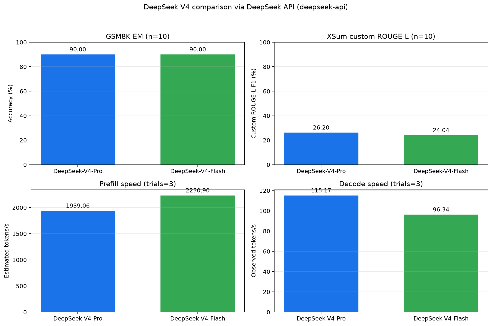
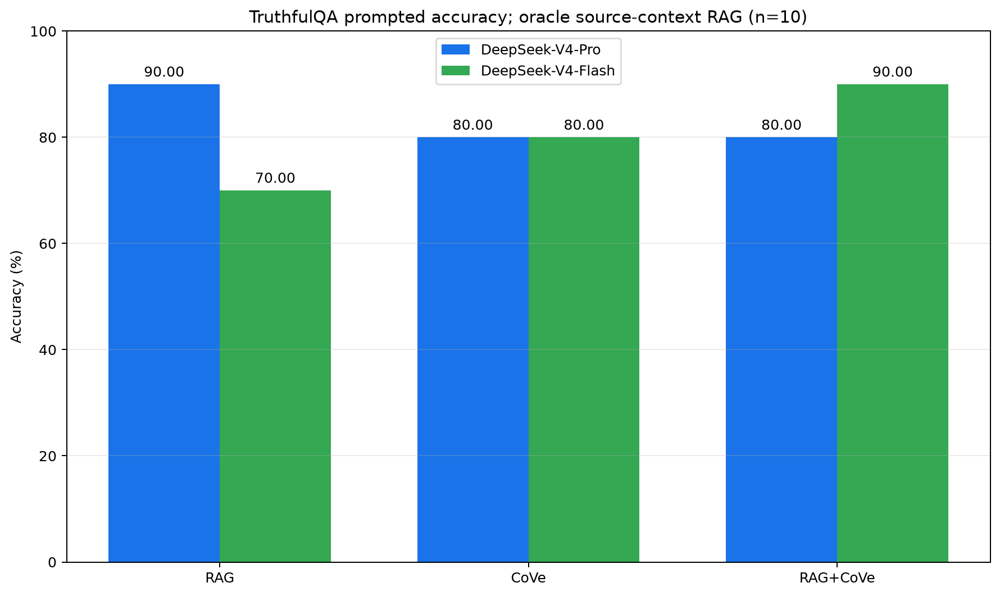

## DISTURBINGBORINGANNOYINGFINESURE

#### 评测指标

##### `plot_deepseek_v4_benchmark.py`
评测四种指标：
1. GSM8K 数学题精确匹配率
2. XSum 摘要的 ROUGE‑L F1
3. 预填充速度与解码速度
可以粗略衡量模型的推理能力、摘要质量和吞吐效率

##### `plot_deepseek_v4_truthfulqa.py`
在 TruthfulQA 上对比四种策略的正确率：
1. 纯模型
2. RAG 增强
3. CoVe增强
4. RAG + CoVe
反映不同增强方法对真实性的提升

#### 实验设计
- **数据来源：** 从 Hugging Face 实时拉取数据集，通过 API 访问模型，保证结果相对可靠
- **实验细节：** 指定样本数评测、通过生成随机种子选择样本；结果保存在 CSV 表格中，最终通过 CSV 表格自动生成柱状图

---
评测实验重复次数少，图片数据真实，但可靠性存疑